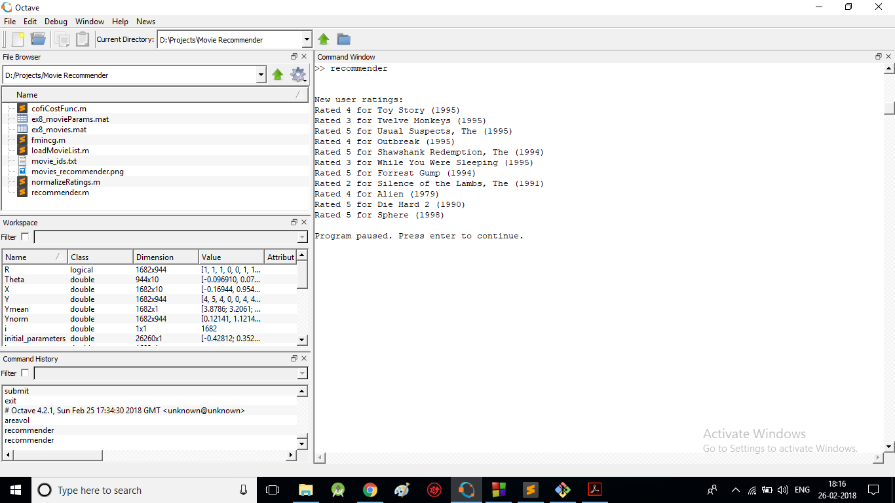
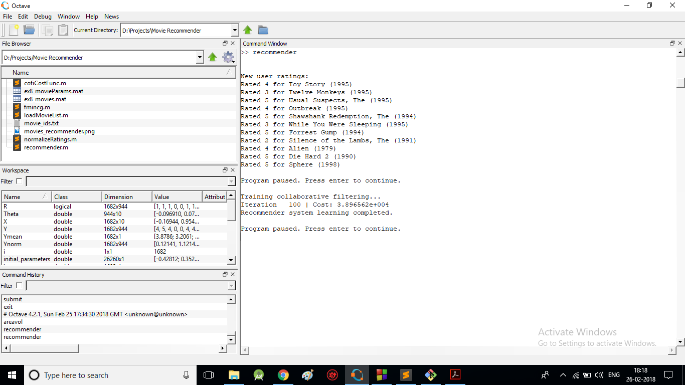
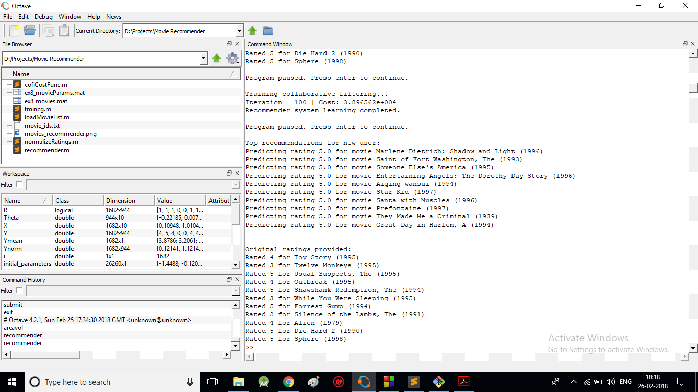

  

# Movies Recommender  
  
#### __*A system to recommend movies according to ratings provided by users using Collaborative Filtering Learning Algorithm.*__  
  
  
  
### Description :ledger:    
This system will implement the collaborative filtering learning algorithm and apply it to a dataset of movie ratings.  
This dataset consists of ratings on a scale of 1 to 5. The dataset has n(u) = 943 users, and n(m) = 1682 movies.  
The matrix Y (a num movies X num users matrix) stores the ratings y(i,j) (from 1 to 5).  
The matrix R is an binary-valued indicator matrix, where R(i,j) = 1 if user j gave a rating to movie i, and R(i; j) = 0 otherwise.  
The objective of collaborative filtering is to predict movie ratings for the movies that users have not yet rated, that is, the entries 
with R(i,j) = 0.  
This will allow us to recommend the movies with the highest predicted ratings to the user.  
  
  
  
### How it works :question:  
Step 1: Modify 'recommender' script to input your own ratings against different movies.   
Step 2: Run 'recommender' script in your Octave/Matlab command window.  
Step 3: This run 100 iterations, first to train & then outputs the movies best suited for you (recommended).   
  
  
  
### Output
  
  
  
  
  
  
### Development  
  
Want to contribute? **:pencil:**  
  
To fix a bug or enhance an existing module, follow these steps:  
  
1. Fork the repo
2. Create a new branch (`git checkout -b exciting-stuff`)
3. Make the appropriate changes in the files
4. Add changes to reflect the changes made
5. Commit your changes (`git commit -am 'exciting-stuff!!'`)
6. Push to the branch (`git push origin exciting-stuff`)
7. Create a Pull Request  
  
  
### Interested?  
  
If you find a bug (the system couldn't handle the query and / or gave irrelevant results), kindly open an issue [here](https://github.com/thegenuinegourav/Movies-Recommender/issues/new) by including your search query and the expected result.  
  
If you'd like to request a new functionality, feel free to do so by opening an issue [here](https://github.com/thegenuinegourav/Movies-Recommender/issues/new) including some sample queries and their corresponding results.  
  
  

### How to Build
* launch Octave/Matlab
* select **Open command window**
* select the project folder
* type 'recommender' on command window  
  
  
### Articles to Learn
* https://blog.dominodatalab.com/recommender-systems-collaborative-filtering/
* https://en.wikipedia.org/wiki/Collaborative_filtering
* https://gist.github.com/obstschale/7320846  
